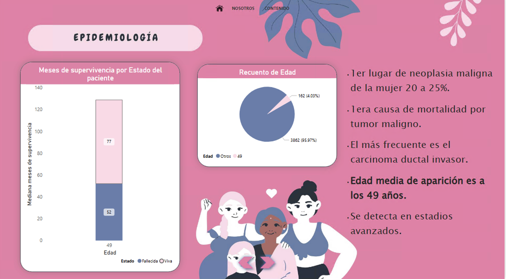
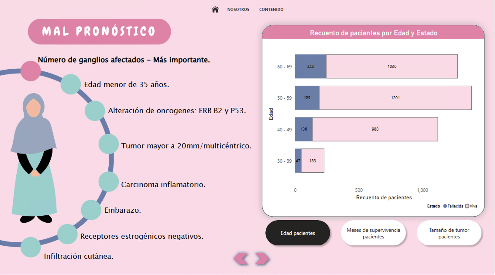

# Análisis de mercado para Ubra Health — Cáncer de mama en EE.UU.

## Equipo

Este proyecto ha sido desarrollado por **Amanda Hernández**, **Jazmín Sánchez** y **Maleni Espinoza**, analistas de datos.

Nuestro objetivo ha sido asesorar a **Ubra Health**, una empresa española que desarrolla sujetadores inteligentes diseñados para monitorizar, detectar precozmente y prevenir el cáncer de mama.  
El producto de Ubra Health integra sensores conectados a una app móvil, proporcionando información instantánea para acelerar diagnósticos, realizar seguimiento y facilitar consultas online con especialistas. Además, la empresa promueve formaciones y una comunidad de apoyo para las usuarias.

El análisis que presentamos busca proporcionar **insights clave sobre el mercado norteamericano**, con el fin de apoyar la estrategia de introducción de este producto en **Estados Unidos**.

## Contexto

El cáncer de mama representa **el 30% de los nuevos diagnósticos de cáncer en mujeres en EE.UU.** y aproximadamente **1 de cada 8 mujeres (13%)** lo desarrollará en algún momento de su vida.  
Se estima que en 2025 habrá **317,000 nuevos casos** de cáncer de mama invasivo.

Pese a los avances en detección, persisten desafíos importantes:

- Más de **4 millones de mujeres sobrevivientes** en EE.UU.
- Disparidades raciales significativas: las mujeres negras tienen un **38% más de riesgo de mortalidad** que las mujeres blancas.

Nuestro análisis se basa en un **dataset público del Programa SEER** (Surveillance, Epidemiology and End Results) del Instituto Nacional del Cáncer (NCI) de Estados Unidos.  
El dataset incluye información de **4,024 mujeres diagnosticadas entre 2006 y 2010** con carcinoma ductal y lobulillar infiltrante, asegurando datos completos y de calidad sobre:

- Tamaño tumoral
- Afectación de ganglios linfáticos
- Supervivencia

## Objetivos

1. Comprender el perfil clínico y demográfico de las pacientes diagnosticadas en EE.UU.
2. Identificar características relacionadas con detección y evolución de la enfermedad (edad, tamaño tumoral, ganglios, supervivencia).
3. Detectar segmentos clave de la población que podrían beneficiarse del sujetador inteligente de Ubra Health.
4. Aportar **insights y recomendaciones estratégicas**, basadas en datos, para evaluar la viabilidad y necesidades del mercado norteamericano.

## Metodología

- **Fuente de datos**: SEER (NCI)
- **Periodo de estudio**: 2006–2010
- **Muestra**: 4,024 mujeres con datos completos

El análisis ha sido desarrollado utilizando **Microsoft Power BI**, permitiendo una exploración visual e interactiva de los datos para facilitar la interpretación de los resultados.

## Principales hallazgos

- **Edad media al diagnóstico**: 49 años
- **Segmento clave**: Mujeres de 50 a 59 años (35% de los casos)
- **Factores de riesgo**: género, antecedentes familiares (genes BRCA1 y BRCA2), densidad mamaria, estilo de vida
- **Factores de mal pronóstico**: número de ganglios afectados, tumor >20 mm, edad <35 años, cáncer inflamatorio, embarazo

### Segmentación demográfica destacada

- **30–39 años**: cáncer más agresivo y metastásico; 90% sintomáticas, pero retrasan pruebas.
- **40–49 años**: recomendación de mamografías anuales; menor propagación a ganglios.
- **50–59 años**: menopausia y cambios hormonales clave; alto porcentaje en estadios avanzados.
- **60–69 años**: mayor supervivencia en mujeres casadas.

## Relevancia para Ubra Health

El análisis confirma que el mercado estadounidense presenta una **necesidad evidente de soluciones que faciliten**:

- Detección temprana
- Seguimiento personalizado
- Acompañamiento emocional

Ámbitos en los que Ubra Health puede aportar un **valor diferencial** a través de su tecnología.

## Herramientas utilizadas

- **Microsoft Power BI** — Análisis y visualización de datos
- **SEER Database (NCI)** — Fuente de datos

## Recomendaciones estratégicas

- Focalizar estrategias de marketing y sensibilización en mujeres de **50–59 años**, incluyendo subgrupos raciales vulnerables.
- Reforzar el valor añadido del producto en **detección temprana** y **seguimiento personalizado**, especialmente en segmentos con diagnóstico tardío.
- Ofrecer **educación y recursos** que ayuden a superar las barreras de acceso a pruebas preventivas y mejorar la adherencia a seguimiento médico.

## Referencias

1. American Cancer Society. (2023). *Breast Cancer Facts & Figures 2022-2024*. Atlanta: American Cancer Society, Inc.
2. National Cancer Institute (NCI). SEER Program. Retrieved from https://seer.cancer.gov
3. Centers for Disease Control and Prevention (CDC). (2023). *Breast Cancer Statistics*. Retrieved from https://www.cdc.gov/cancer/breast/statistics/
4. American Society of Clinical Oncology (ASCO). (2023). *Breast Cancer: Statistics*. Retrieved from https://www.cancer.net/cancer-types/breast-cancer/statistics
5. Ubra Health (2024). *Propuesta de valor y características del producto*. Información facilitada por la empresa.

## Visualizaciones del análisis

A continuación, se muestran algunas de las visualizaciones clave desarrolladas en Power BI para este estudio:

